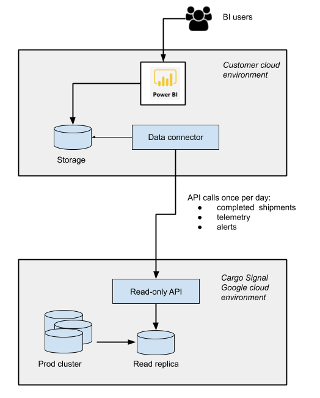

<h1 align="center">Cargo Signal BI Data Connector</h1>

<h3 align="center">
Open Source Connector for Cargo Signal Business Intelligence
</h3>

<hr/>

<h2><a href="#id1">1&nbsp;&nbsp;&nbsp;About this document</a></h2>
  <p>The Data Connector is a sample solution to demonstrate how to leverage Cargo Signal APIs, cloud storage and BI tools to better understand your shipments through analytics.  The solution provides for retrieving completed shipments along with the associated telemetry and alert data. This data is pushed to Azure, where a PowerBI can retrieve the data and provide a dashboard representing your completed shipments.</p>
  <p>The solution leverages Cargo Signal APIs, Java 8, Microsoft Azure and Microsoft Power BI.  If your organization prefers C# or Python for the implementation language, or Amazon Web Services over Azure, or Tableau over Microsoft BI, you should be able to use this solution as a reference solution to customize and build the solution that best fits your organization's environment and technology stack.</p>

<h2><a href="#id2">2&nbsp;&nbsp;&nbsp;Prerequisites</a></h2>
  <p>To use the sample application, you will need:</p>
  <ul>
    <li>Cargo Signal API client key</li>
    <li>Development IDE</li>
    <li>Java 8</li>
    <li>Maven</li>
    <li>Microsoft Azure Account</li>
    <li>Microsoft Power BI</li>
  </ul>

<h2><a href="#id3">3&nbsp;&nbsp;&nbsp;How Does It Work</a></h2>

The figure below illustrates the end-to-end architecture of the BI integration solution. At the core of the system, the Cargo Signal public API provides
access to shipment, telemetry and alert data. The Data Connector can be built and run as an Azure function or modified to run as a stand alone application.
If run as an Azure function, the connector will pull new data for completed shipments from CargoSignal once per day, or on another specified interval. The
Data Connector deposits data returned from the API into Azure blob storage csollections. Once stored in blog storage, the data can be access and analyized
with PowerBI.



<h2><a href="#id4">4&nbsp;&nbsp;&nbsp;Usage</a></h2>
  <p>The Data Connector exposes two HTTP endpoints along with a scheduled timer:</p>
  <p>Health</p>
  <p>The health endpoint is an HTTP endpoint that simply returns a 200 response and the text "Ok" when it is hit.  The endpoint is simply used to validate that the Azure Functions are deployed and running.</p>

```http
GET https://YOUR_DOMAIN.com/health
```

  <p>Shipments (via HTTP)</p>
  <p>The shipments endpoint is an HTTP endpoint that will retrieve shipments, telemetry data for the shipments and alert data for the shipments.</p>

```http
GET https://YOUR_DOMAIN.com/shipments
```

  <p>Shipments (via Timer)</p>
  <p>The shipments timer-invoked function returns the same data as the Shipments HTTP function.  By default it is configured to execute once per day and retrieve data from the last day.  The frequency of its execution can be modified by changing the Data Connector code to use a different date.</p>

<h2><a href="#id5">5&nbsp;&nbsp;&nbsp;IDE Setup</a></h2>
  <p>While any code editor will work, Visual Studio Code and IntelliJ offer additional built-in Azure and Java functionality that you will likely find helpful.</p>
  <h3>Visual Studio Code</h3> <p><a href="https://code.visualstudio.com/download">Download VS Code</a></p>
  <p><a href="https://docs.microsoft.com/en-us/azure/azure-functions/functions-run-local?tabs=macos%2Ccsharp%2Cbash#v2">Install Azure Function Tools in VS Code</a></p>
  <h3>IntelliJ </h3><p><a href="https://www.jetbrains.com/idea/download/">Download IntelliJ</a></p>
  <p><a href="https://docs.microsoft.com/en-us/azure/developer/java/toolkit-for-intellij/installation">Install Azure Dev Tools plugin for IntelliJ</a></p>

<h2><a href="#id6">6&nbsp;&nbsp;&nbsp;Build and Execute Data Connector</a></h2>
<p>To build, run "mvn clean package" from the command line.</p>
<p>To execute, run "mvn azure-functions:run" from the command line. </p>
<p>To get this to run you will need to set the environment variables that are listed in the deployment section.</p>

<h2><a href="#id7">7&nbsp;&nbsp;&nbsp;Deployment</a></h2>
<p>Deployment can be achieved via scripts (e.g. PowerShell), CI/CD pipelines or from Visual Studio Code or IntelliJ.</p>
<p>For deployment from Visual Studio Code, see the <a href="https://docs.microsoft.com/en-us/azure/developer/javascript/tutorial-vscode-serverless-node-01?tabs=bash">Deploy Azure Functions from Visual Studio Code</a> article from Microsoft.</p>
<p>For deployment from JetBrains IntelliJ, see the <a href="https://blog.jetbrains.com/dotnet/2019/05/09/building-azure-functions-sql-database-improvements-azure-toolkit-rider-2019-1/">blog</a> from JetBrains.</p>
<p>The Data Connector relies on a set of Azure application settings for its Azure Functions to operate properly.  Application settings you will need to provide in the Azure portal or via deployment tools are:</p>
<ul>
  <li>BI_CONNECTOR_CONNECTION_STRING - the connection string to your Azure Blob Storage</li>
  <li>HOST - the Cargo Signal public API endpoint</li>
  <li>SHIPMENTS_PATH - Path to the Shipments endpoint (located in local.settings.json for reference)</li>
  <li>SHIPMENT_TELEMETRY_PATH - Path to the Shipment Telemetry endpoint (located in local.settings.json for reference)</li>
  <li>SHIPMENT_ALERTS_PATH - Path to the Shipment Alerts endpoint (located in local.settings.json for reference)</li>
  <li>WEBSITE_TIME_ZONE - (Optional) The time zone for the CRON expression on the timer trigger.  Makes it easy to write the expression in local time rather than calculate UTC</li>
  <li>AUTHORIZATION_URL - URL of where to get the bearer token</li>  
  <li>AUDIENCE - the url you are going to authenticate for</li>
  <li>CLIENT_ID - the client id you were given to access Cargo Signal APIs</li>
  <li>CLIENT_SECRET - the client secret you were given to access Cargo Signal APIs</li>
</ul>

<h2><a href="#id8">8&nbsp;&nbsp;&nbsp;Tips</a></h2>
<h4>Visual Studio Code</h4>
<ul>
  <li><a href="https://github.com/microsoft/azure-tools-for-java/wiki/FAQ">Maven and JavaHome Path issues in VS Code</a></li>
  <li>To enable VS Code to run from command line - "Press CMD + SHIFT + P, type shell command and select Install code command in path. Afterwards, navigate to any project from the terminal and type code . from the directory to launch the project using VS Code."  Run VS Code from command line so it picks up environment variables for mvn path and java home.</li>
</ul>
<h4>JetBrains IntelliJ</h4>
<ul>
  <li>The project may at first get imported strangely, you may see src/main and src/test treated as separate modules. Give the IDE a moment to finish up initializing, and wait for a message box that says "Non-managed pom.xml found". Then click on the "Add as Maven Project" link in the box. After some work, the view should re-adjust itself to show just the one module, Data-Connector.</li>
  <li>If the initial import of the project treated main and test as separate modules, then you will also have to delete the main.iml and test.iml files that Intellij generated. This should fix any unrecognized import problems you may have at this point.</li>
</ul>
<h4>General Tips</h4>
<ul>
  <li>In local.settings.json, the AzureWebJobStorage field can be set "UseDevelopmentStorage=true" on Windows if you have the Azure Emulator running; otherwise don't set it to this or the timer trigger will get a Connection Refused error.</li>
</ul>

## Usage

The Data Connector calls three Cargo Signal APIs that are defined in the Cargo Signal Public API:

<ul>
  <li>Shipments.  https://api.cargosignal.com/docs/index.html#resources-shipment-documentation-get-shipments</li>
  <li>Telemetry Data.  https://api.cargosignal.com/docs/index.html#resources-shipment-documentation-get-telemetry-data</li>
  <li>Shipment Alerts.  Arriving in future release.</li>
</ul>

## Cargo Signal Public API

The Data Connector relies on the Cargo Signal public API to retreive shipment, telemetry and alert data from the Cargo Signal system. The public API is
documented at https://api.cargosignal.com. A valid access key (bearer token) is required to access the API and use the Data Connector. The data connector
utilizes the following three APIs:

* [Get shipments](https://api.cargosignal.com/docs/index.html#resources-shipment-documentation-get-shipments)
* GET /alerts - coming soon
* [Get telemetry data](https://api.cargosignal.com/docs/index.html#resources-shipment-documentation-get-telemetry-data)

&copy; 2020 Cargo Signal
